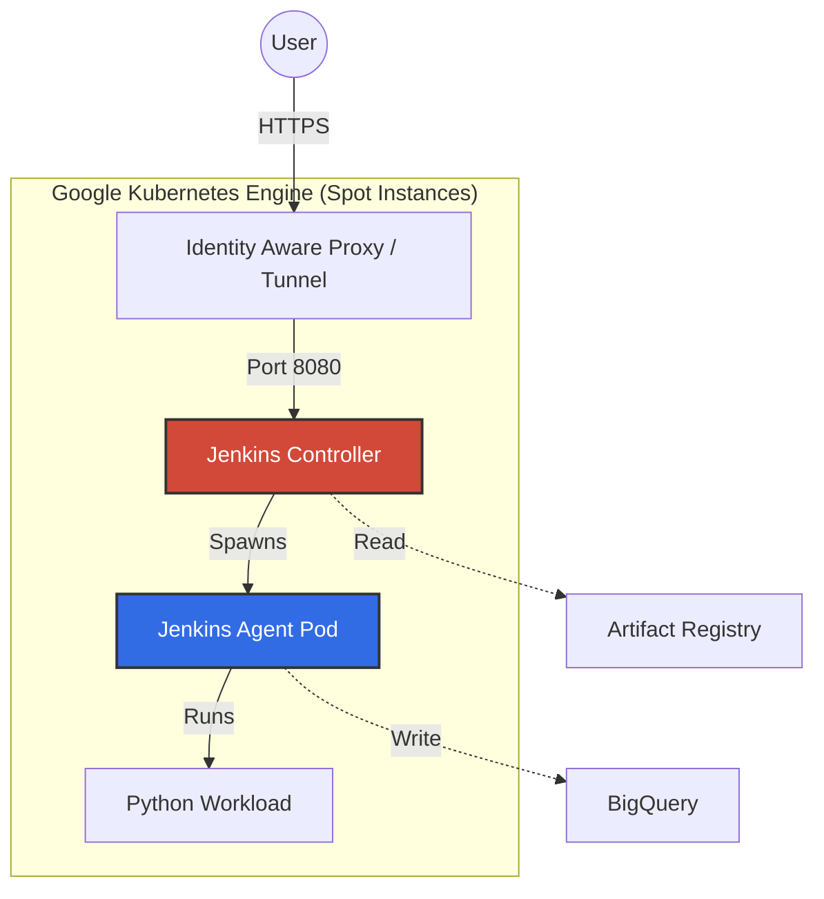

# 🚀 jenpy: Ephemeral Jenkins on GKE (Spot Instances)

[](https://cloud.google.com/)
[](https://kubernetes.io/)
[](https://www.jenkins.io/)
[](LICENSE)

**A fully automated Infrastructure-as-Code (IaC) solution to deploy a disposable Jenkins Controller on Google Kubernetes Engine (GKE).**

This project uses **Spot VM instances** to minimize costs and **Jenkins Configuration as Code (JCasC)** to eliminate manual UI setup. Pipelines, credentials, and cloud connections are pre-baked into the Docker image.

---

## 🏗 Architecture



* **Compute:** GKE Standard (Spot Instances)
* **Storage:** Persistent Volume Claim (PVC) for `JENKINS_HOME`
* **Security:** Workload Identity (No JSON Keys)
* **Config:** JCasC (YAML-based)
* **Pipeline:** Automated Job DSL

---

## 🛠 Prerequisites

Ensure you have the following installed locally (WSL/Linux/Mac):

* [Google Cloud SDK](https://cloud.google.com/sdk/docs/install) (`gcloud`)
* [Kubernetes CLI](https://kubernetes.io/docs/tasks/tools/) (`kubectl`)
* [Docker](https://docs.docker.com/get-docker/) (`docker`)

---

## ⚙️ Configuration

### 1. Secrets Management

> 🛑 **WARNING:** Never commit `config.env` to Git. It is already in `.gitignore`.

Create a `config.env` file in the root directory:

```bash
# config.env
PROJECT_ID="your-gcp-project-id"
CLUSTER_NAME="jenkins-demo-cluster"
ZONE="europe-west1-b"
IMAGE_URL="europe-west1-docker.pkg.dev/your-project/repo/controller:v1"

```

### 2. Initialization

Run this once to authenticate and configure Docker credential helpers:

```bash
./scripts/00-init-gcp.sh

```

---

## 🔁 The Lifecycle

Follow this sequence to spin up, use, and destroy the environment.

### 1. 🏗️ Build Controller Image

Compiles the custom Docker image with JCasC settings, Plugins, and Themes.
*Run this only when you modify `jenkins.yaml` or `plugins.txt`.*

```bash
./jenkins-controller/build.sh

```

### 2. ☁️ Provision Infrastructure

Creates a GKE Cluster using Spot Instances (saves ~60-90% cost).
*⏳ Duration: ~5-8 minutes*

```bash
./scripts/01-cluster-up.sh

```

### 3. 🚀 Deploy Jenkins

Applies Kubernetes manifests and injects secrets.
*⏳ Duration: ~2 minutes*

```bash
source config.env  # Load secrets first!
./scripts/02-deploy-k8s.sh

```

### 4. 🔑 Access Jenkins

Because the cluster is private, use a secure tunnel to access the UI.

```bash
kubectl port-forward svc/jenkins-service 9090:80 -n jenkins

```

👉 **URL:** [http://127.0.0.1:9090](http://127.0.0.1:9090)

### 5. 🧨 Destroy (Save Money)

**CRITICAL:** Run this immediately after you are done to stop billing.

```bash
./scripts/99-cluster-down.sh

```

*Destroys: Cluster, Nodes, Load Balancers, Disks.*
*Keeps: Artifact Registry Images & IAM Roles.*

---

## 🧠 Key Technical Decisions

| Challenge | Solution | Why? |
| --- | --- | --- |
| **Volume Overwrites** | Moved config to `/var/jenkins_config` | K8s mounts a blank disk at `/var/jenkins_home`, hiding baked-in configs. We move them to a safe path. |
| **Env Variables** | Injection via `GlobalNodeProperties` | Agents run in separate pods and don't inherit Controller variables. We explicitly pass `PROJECT_ID` so agents know the context. |
| **DNS Resolution** | `jenkins-service.jenkins...` | Agents need a fully qualified domain name (FQDN) to reliably call back to the Controller inside K8s. |

---

## 📂 Repository Structure

```text
.
├── app/                      # Python Application Code (The "Workload")
├── jenkins-controller/       # Custom Jenkins Image Source
│   ├── Dockerfile            # Installs GCloud SDK, Plugins
│   ├── jenkins.yaml          # JCasC Configuration
│   └── plugins.txt           # Plugin list
├── k8s/                      # Kubernetes Manifests
│   ├── 01-pvc.yaml           # Persistent Storage
│   ├── 03-deployment.yaml    # The Controller
│   └── ...
├── scripts/                  # Automation Scripts
│   ├── 01-cluster-up.sh      # Infra Provisioning
│   └── 99-cluster-down.sh    # Cleanup
├── pipelines/                # Jenkinsfiles
└── config.env                # Secrets (Ignored)

```

# 🛠 Manual Configuration Guide

This guide documents the manual steps to configure Jenkins if the **JCasC automation is disabled or fails**.

> **Note:** If `jenkins.yaml` is working correctly, you do **not** need to do this. These settings are already applied automatically.

---

## 1. Configure Kubernetes Cloud
*Fixes: Agent Pods not starting or staying "Offline".*

1. Navigate to **Manage Jenkins** → **Clouds** → **kubernetes**.
2. Set the following values:
    * **Kubernetes Namespace:** `jenkins`
    * **Jenkins URL:** `http://jenkins-service.jenkins.svc.cluster.local`
    * **Jenkins Tunnel:** `jenkins-service.jenkins.svc.cluster.local:50000`
3. **Pod Retention:** Set to `Never` (or `On Failure` for debugging).
4. Click **Save**.

> ⚠️ **Critical:** Do NOT use port `:8080` in the Jenkins URL. The K8s Service listens on Port 80.

---

## 2. Add GitHub Credentials
*Fixes: Pipeline cannot download the Jenkinsfile from a Private Repo.*

1. Navigate to **Manage Jenkins** → **Credentials**.
2. Click **(global)** → **+ Add Credentials**.
3. Fill in the form:

| Field | Value |
| :--- | :--- |
| **Kind** | `Username with password` |
| **Scope** | `Global` |
| **Username** | Your GitHub Username (e.g., `keibrunas`) |
| **Password** | Your Personal Access Token (`ghp_...`) |
| **ID** | `github-access-token` |
| **Description** | `Manual GitHub Token` |

---

## 3. Create the Pipeline Job
*Fixes: The "BigQuery-Demo" job is missing from the dashboard.*

1. **Dashboard** → **+ New Item**.
2. Name: `BigQuery-Demo` → Select **Pipeline** → **OK**.
3. Scroll to the **Pipeline** section and configure:
    * **Definition:** `Pipeline script from SCM`
    * **SCM:** `Git`
    * **Repository URL:** `https://github.com/keibrunas/jenpy.git`
    * **Credentials:** Select `github-access-token`
    * **Branch Specifier:** `*/main`
    * **Script Path:** `pipelines/demo-pipeline.jenkinsfile`
4. Click **Save**.

---

## 4. Inject Environment Variables
*Fixes: Python script failing with `Project ID null`.*

1. Navigate to **Manage Jenkins** → **System**.
2. Scroll to **Global properties**.
3. Check the box **Environment variables** and click **Add**.
    * **Name:** `PROJECT_ID`
    * **Value:** `your-actual-gcp-project-id`
4. Click **Save**.