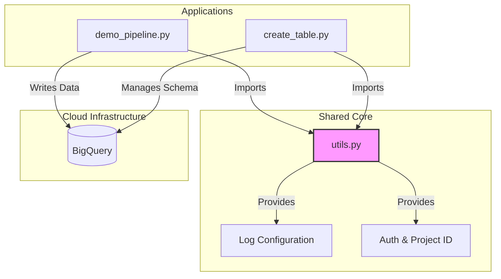

This is the updated **README.md** for the `app/` directory.

I have aligned the style with the previous documentation ("Senior Developer" tone) and integrated all the architectural changes we implemented: the **Modularization** (utils.py), **Workload Identity** logic, **Kubernetes Logging**, and **Type Safety** improvements.

---

# 🐍 Python Workloads & Tools

This directory contains the core application logic of the Data Platform.
The scripts are designed to execute as **stateless micro-tasks** inside **Ephemeral Kubernetes Agents**. They adhere to strict coding standards (Pylint 10/10), Type Safety (Pylance), and Cloud-Native best practices.

---

## 📂 Architecture Overview

We have moved away from monolithic scripts. Common logic (logging, authentication) has been extracted into a shared utility module to adhere to the **DRY (Don't Repeat Yourself)** principle.



### File Index

| File | Type | Description |
| --- | --- | --- |
| `utils.py` | **Core Lib** | **NEW.** Shared logic for Idempotent Logging and Robust Authentication (Env vs. Workload Identity). |
| `demo_pipeline.py` | **ETL Job** | A self-healing ingestion script. Inserts build metadata into BigQuery using UTC timestamps. |
| `create_table.py` | **Infra Tool** | Schema management utility. Applies JSON schemas from `config/` to BigQuery. |
| `config/` | **Schemas** | JSON definitions for BigQuery tables. Naming convention: `<dataset>_<table>.json`. |

---

## ⚙️ Configuration (Environment Variables)

These scripts are configured strictly via **Environment Variables** injected by Jenkins.

### 1. Global Variables (Handled by `utils.py`)

| Variable | Required | Description |
| --- | --- | --- |
| `PROJECT_ID` | ❌ Optional | The GCP Project ID. If missing, the code automatically attempts to derive it from **GCP Workload Identity**. |

### 2. Configuration for `demo_pipeline.py`

| Variable | Default | Description |
| --- | --- | --- |
| `DATASET_ID` | `jenkins_demo_db` | Target BigQuery Dataset. |
| `TABLE_ID` | `build_logs` | Target Table name. |
| `BUILD_NUMBER` | `LOCAL-DEV` | Build identifier for data lineage. |

### 3. Configuration for `create_table.py`

| Variable | Required | Description |
| --- | --- | --- |
| `DATASET_ID` | ✅ Yes | Target Dataset. |
| `TABLE_ID` | ✅ Yes | Target Table to create/update. |
| *Schema Path* | *Auto* | Lookups `config/<DATASET_ID>_<TABLE_ID>.json`. |

---

## 🧠 Deep Dive: Technical Implementation

### 1. Robust Authentication (`utils.get_project_id`)

We implemented a "Fallback Strategy" to support both local development and Kubernetes execution without changing code.

1. **Priority 1:** Checks `os.getenv("PROJECT_ID")`.
2. **Priority 2:** Calls `google.auth.default()`.
3. **Type Safety:** explicitly validates that the returned Project ID is not `None`, raising a `ValueError` otherwise. This satisfies strict **Pylance** type checking.

### 2. Kubernetes-Ready Logging (`utils.setup_logging`)

Standard Python logging buffers output. In Kubernetes, if a Pod crashes (OOM), buffered logs are lost.

* **Our Solution:** We configure a `StreamHandler` pointing to `sys.stdout`.
* **Jenkins Integration:** When combined with `PYTHONUNBUFFERED=1` in the Pod YAML, this guarantees real-time log streaming in the Jenkins Console.

### 3. BigQuery Best Practices

* **Deprecation Fix:** We replaced the deprecated `client.dataset()` factory with the modern `bigquery.DatasetReference` constructor.
* **UTC Timestamps:** All time-series data is generated using `datetime.timezone.utc` to prevent timezone misalignment across servers.

---

## 💻 Local Development Guide

Since we refactored the code into a package structure (using `app.utils`), running scripts locally requires setting the **PYTHONPATH**.

### 1. Setup Virtual Environment

```bash
python -m venv venv
source venv/bin/activate
pip install -r requirements.txt

```

### 2. Run Scripts

You **must** include the current directory (`.`) in the python path so the scripts can find `app.utils`.

**Option A: Using PYTHONPATH (Recommended)**

```bash
export PROJECT_ID="my-gcp-project"
export PYTHONPATH=. 

# Run the pipeline
python app/demo_pipeline.py

```

**Option B: Running as a Module**

```bash
# Run from the root directory
python -m app.demo_pipeline

```

---

## ✅ Quality Standards

This codebase enforces strict quality gates via CI/CD:

* **Linting:** Pylint Score must be **> 9.0/10**.
* **Formatting:** Code must be formatted with **Black**.
* **Type Hints:** All functions have type annotations (`-> str`, `-> None`).
* **No Unused Imports:** The code is clean of dead dependencies.