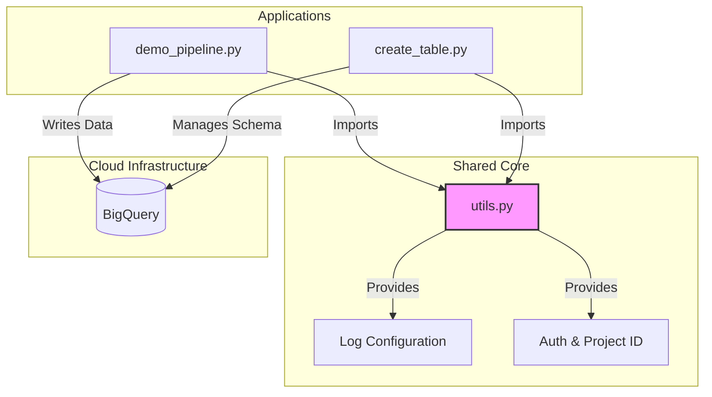

# 🐍 Python Workloads & Tools

This directory contains the core application logic of the Data Platform.
The scripts are designed to execute as **stateless micro-tasks** inside **Ephemeral Kubernetes Agents**. They adhere to strict coding standards (Pylint 10/10), Type Safety (Pylance), and Cloud-Native best practices.

---

## 📂 Architecture Overview

We have moved away from monolithic scripts. Common logic (logging, authentication) has been extracted into a shared utility module to adhere to the **DRY (Don't Repeat Yourself)** principle.



### File Index

| File | Type | Description |
| --- | --- | --- |
| `utils.py` | **Core Lib** | **NEW.** Shared logic for Idempotent Logging and Robust Authentication (Env vs. Workload Identity). |
| `demo_pipeline.py` | **ETL Job** | A self-healing ingestion script. Inserts build metadata into BigQuery using UTC timestamps. |
| `create_table.py` | **Infra Tool** | Schema management utility. Applies JSON schemas from `config/` to BigQuery. |
| `config/` | **Schemas** | JSON definitions for BigQuery tables. Naming convention: `<dataset>_<table>.json`. |
| `tests/` | **QA** | Unit tests suite using `pytest` and mocks (see [tests/README.md](https://www.google.com/search?q=tests/README.md)). |

---

## 🧠 Logical Flows & Deep Dive

### 1. `demo_pipeline.py`: The Self-Healing ETL Worker

This script implements a resilient **ELT (Extract, Load, Transform)** pattern designed for unstable or empty environments. It is "Self-Healing," meaning it automatically provisions missing infrastructure instead of crashing.

* **Initialization & Auth:**
It leverages `app.utils` to resolve the Project ID (Env Var vs. Workload Identity) and configures an unbuffered logger specifically tuned for Kubernetes streaming.
* **Infrastructure Provisioning (Idempotency):**
Before inserting data, it performs a "Pre-flight Check":
1. **Dataset:** Checks if the target `DATASET_ID` exists. If `NotFound`, it creates it using the modern `bigquery.DatasetReference`.
2. **Table:** Checks if the `TABLE_ID` exists. If missing, it creates it with a **Strict Schema** (Build ID, Timestamp, Status) defined directly in the code.


* **Data Integrity (Timezones):**
To avoid timezone misalignment between Jenkins (e.g., CET) and Cloud (UTC), this script strictly generates timestamps using `datetime.now(datetime.timezone.utc)`.
* **Atomic Insertion:**
It uses the streaming API `client.insert_rows_json`. It explicitly checks for partial failures (row-level errors) and raises a `RuntimeError` to ensure Jenkins marks the pipeline as **FAILED** if data is not 100% consistent.

### 2. `create_table.py`: Idempotent Infrastructure-as-Code

This utility enforces a **Schema-First** approach to data management. It treats BigQuery tables as versioned resources defined by JSON files.

* **Convention over Configuration:**
Instead of accepting complex schema arguments, it resolves the schema path dynamically based on inputs:
* Input: `DATASET_ID="finance"`, `TABLE_ID="transactions"`
* Resolved Path: `config/finance_transactions.json`
* *Benefit:* Prevents deployment errors by ensuring the schema file strictly matches the target table.


* **Safety First (Idempotency):**
It prevents accidental schema overwrites.
1. It attempts to fetch the table metadata first.
2. If the table exists, it logs a warning (`✅ Table already exists`) and exits with **Code 0 (Success)**. It does **not** alter existing resources.
3. Only if the table is missing does it proceed to load the JSON and call `create_table`.


* **Robustness:**
It uses Python's `pathlib` for safe cross-platform file system navigation and validates the JSON structure via the Google Cloud library's strict parsing before making any API calls.

---

## ⚙️ Configuration (Environment Variables)

These scripts are configured strictly via **Environment Variables** injected by Jenkins.

### 1. Global Variables (Handled by `utils.py`)

| Variable | Required | Description |
| --- | --- | --- |
| `PROJECT_ID` | ❌ Optional | The GCP Project ID. If missing, the code automatically attempts to derive it from **GCP Workload Identity**. |

### 2. Configuration for `demo_pipeline.py`

| Variable | Default | Description |
| --- | --- | --- |
| `DATASET_ID` | `jenkins_demo_db` | Target BigQuery Dataset. |
| `TABLE_ID` | `build_logs` | Target Table name. |
| `BUILD_NUMBER` | `LOCAL-DEV` | Build identifier for data lineage. |

### 3. Configuration for `create_table.py`

| Variable | Required | Description |
| --- | --- | --- |
| `DATASET_ID` | ✅ Yes | Target Dataset. |
| `TABLE_ID` | ✅ Yes | Target Table to create/update. |
| *Schema Path* | *Auto* | Lookups `config/<DATASET_ID>_<TABLE_ID>.json`. |

---

## 🧠 Deep Dive: Technical Implementation

### 1. Robust Authentication (`utils.get_project_id`)

We implemented a "Fallback Strategy" to support both local development and Kubernetes execution without changing code.

1. **Priority 1:** Checks `os.getenv("PROJECT_ID")`.
2. **Priority 2:** Calls `google.auth.default()`.
3. **Type Safety:** Explicitly validates that the returned Project ID is not `None`, raising a `ValueError` otherwise. This satisfies strict **Pylance** type checking.

### 2. Kubernetes-Ready Logging (`utils.setup_logging`)

Standard Python logging buffers output. In Kubernetes, if a Pod crashes (OOM), buffered logs are lost.

* **Our Solution:** We configure a `StreamHandler` pointing to `sys.stdout`.
* **Jenkins Integration:** When combined with `PYTHONUNBUFFERED=1` in the Pod YAML, this guarantees real-time log streaming in the Jenkins Console.

---

## 💻 Local Development Guide

Since we refactored the code into a package structure (using `app.utils`), running scripts locally requires setting the **PYTHONPATH**.

### 1. Setup Virtual Environment

```bash
python -m venv venv
source venv/bin/activate
pip install -r requirements.txt

```

### 2. Run Scripts

You **must** include the current directory (`.`) in the python path so the scripts can find `app.utils`.

**Option A: Using PYTHONPATH (Recommended)**

```bash
export PROJECT_ID="my-gcp-project"
export PYTHONPATH=. 

# Run the pipeline
python app/demo_pipeline.py

```

**Option B: Running as a Module**

```bash
# Run from the root directory
python -m app.demo_pipeline

```

---

## ✅ Quality Standards

This codebase enforces strict quality gates via CI/CD:

* **Linting:** Pylint Score must be **> 9.0/10**.
* **Formatting:** Code must be formatted with **Black**.
* **Type Hints:** All functions have type annotations (`-> str`, `-> None`).
* **Code Coverage:** Tests must cover **100%** of the codebase.