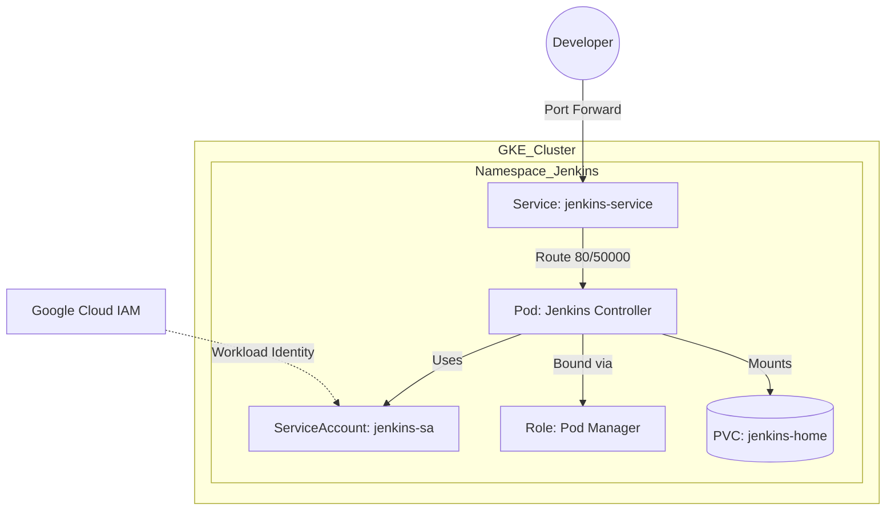

# ☸️ Kubernetes Manifests (The Infrastructure)

This directory contains the declarative YAML files that define the **Jenkins Controller** infrastructure on Google Kubernetes Engine (GKE).

Unlike imperative scripts (which say "do this"), these manifests describe the **Desired State** (what the system *should* look like). We use a templating approach to inject environment-specific variables at deploy time.

---

## 🏗️ Deployment Strategy: The `envsubst` Pattern

Kubernetes does not natively support environment variables inside manifest files (e.g., you cannot write `${PROJECT_ID}` in a standard YAML).

To solve this without complex tools like Helm, we use `envsubst` in our deployment script (`scripts/02-deploy-k8s.sh`).

**The Flow:**
1.  **Source:** `03-deployment.yaml` contains placeholders like `${IMAGE_URL}`.
2.  **Process:** The script pipes the file into `envsubst`.
3.  **Result:** Pure YAML with real values is piped to `kubectl apply`.

---

## 📂 Manifest Catalog

| File | Kind | Priority | Description |
| :--- | :--- | :--- | :--- |
| `01-sa.yaml` | `ServiceAccount` | 1️⃣ High | **Identity.** The identity used by Jenkins within the cluster. Contains the critical annotation for GKE Workload Identity. |
| `02-pvc.yaml` | `PersistentVolumeClaim` | 2️⃣ High | **Storage.** Requests a 10GB persistent disk from Google Cloud to store `JENKINS_HOME` data. |
| `03-deployment.yaml` | `Deployment` | 3️⃣ High | **Compute.** Defines the Jenkins Pod, mounts the storage, sets resource limits, and injects config. |
| `04-service.yaml` | `Service` | 4️⃣ Med | **Network.** A stable internal IP address acting as a load balancer for the Jenkins Pod. |
| `05-rbac.yaml` | `Role` & `Binding` | 5️⃣ Med | **Permissions.** Grants Jenkins the specific rights to "spawn" new agent pods in the namespace. |

---

## 🔍 Technical Deep Dive

### 1. Workload Identity (`01-sa.yaml`)
This is the **Security Cornerstone** of the project. Instead of downloading a static JSON key (risky) and uploading it to Jenkins, we bind the Kubernetes Service Account (`jenkins-sa`) directly to a Google Cloud IAM Service Account.

```yaml
metadata:
  annotations:
    # The Bridge: K8s SA maps to Google SA
    iam.gke.io/gcp-service-account: jenkins-sa@${PROJECT_ID}.iam.gserviceaccount.com

```

**Why?**

* When Python scripts run inside Jenkins or its Agents, the Google Client Library automatically finds credentials injected by GKE.
* No secrets to rotate. No secrets to leak.

### 2. Persistence & Permissions (`03-deployment.yaml`)

Running Jenkins on Kubernetes is tricky because Jenkins drops root privileges (runs as user `1000`). If the Persistent Disk is mounted by `root`, Jenkins crashes with `Permission Denied`.

**The Fix: `securityContext`**
We instruct Kubernetes to mount the volume with specific group ownership:

```yaml
spec:
  securityContext:
    runAsUser: 1000   # The process runs as user 'jenkins'
    fsGroup: 1000     # The volume is mounted with group 'jenkins' ownership

```

This ensures that the `/var/jenkins_home` directory is always writable by the application.

### 3. Networking & Ports (`04-service.yaml`)

The Service is defined as `type: ClusterIP`. This means Jenkins is **NOT exposed to the internet**. It is only accessible from:

1. Inside the cluster (Agents talking to Controller).
2. Via secure Tunnel (`kubectl port-forward`).

**Port Mapping:**

* **Port 80 (Target 8080):** The HTTP Web UI. Used by humans and API calls.
* **Port 50000 (Target 50000):** The JNLP (Java Network Launch Protocol) port. Used by **Agent Pods** to register themselves with the Controller.

### 4. RBAC: The "Master" Permission (`05-rbac.yaml`)

For Jenkins to spin up dynamic agents, it needs permission to talk to the Kubernetes API Server.
We follow the **Principle of Least Privilege**:

* **Allowed:** `create`, `delete`, `get`, `list`, `watch` on **Pods**.
* **Denied:** Everything else (Secrets, Deployments, Services, Nodes).

This limits the "blast radius". If Jenkins is compromised, the attacker can only mess with Pods in the `jenkins` namespace, not the entire cluster.

---

## 📊 Architecture Diagram

