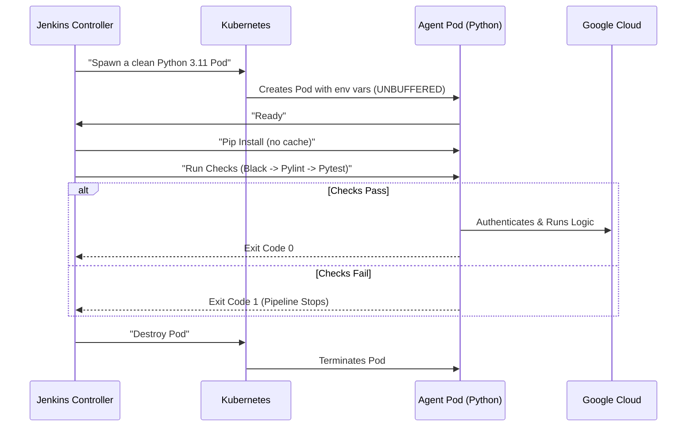

Based on the changes we implemented (strict coverage gates, linting thresholds, and Kubernetes environment optimizations), here is the updated **README.md**.

I have maintained the existing "Senior Developer" style: professional, structured, and visually clear with the "Deep Dive" sections updated to reflect the new architecture.

---

# 🛤️ Jenkins Pipelines (CI/CD)

This directory contains the **Declarative Jenkinsfiles** that drive the automation logic of the platform.
Instead of clicking through the Jenkins UI, we define our build processes as code, versioned alongside the application logic.

---

## 📂 Pipeline Catalog

### 1. `ci-pr-check.jenkinsfile` (The Quality Gate)

* **Type:** Multibranch Pipeline.
* **Trigger:** Automatically triggers on **Pull Requests** or commits to tracked branches.
* **Goal:** Enforce strict code quality standards before merging.

**🔍 Deep Dive:**

* 
**Optimization:** Uses `when { changeset "**/*.py" }` to skip heavy tests if only documentation changes.


* **Formatting (Black):** Checks code style. If unformatted code is found, the build is marked as **UNSTABLE**, but proceeds.


* **Static Analysis (Pylint):** Scans for errors and code smells. Enforces a strict **minimum score of 9.0/10**. If the score drops below this threshold, the pipeline **FAILS**.


* **Test Coverage:** Executes `pytest` with `pytest-cov`. Enforces a hard **90% Code Coverage** gate. If coverage is below 90%, the build **FAILS**.


### 2. `demo-pipeline.jenkinsfile` (The ETL Worker)

* **Type:** Standard Pipeline.
* **Trigger:** Manual (or Scheduled).
* **Goal:** Execute the core Data Engineering workload (`demo_pipeline.py`).

**🔍 Deep Dive:**

* 
**Module Resolution:** Uses `withEnv(['PYTHONPATH=.'])` to allow the script to import shared logic from `app.utils`.


* 
**Secrets Management:** Leverages the bound Kubernetes Service Account (`jenkins-sa`) to authenticate with BigQuery via Workload Identity.


* 
**Performance:** Installs dependencies with `--no-cache-dir` to save I/O in the ephemeral container.


### 3. `create-table.jenkinsfile` (The Utility Tool)

* **Type:** Parameterized Pipeline.
* **Trigger:** Manual (User Input Required).
* **Goal:** Idempotent creation/update of BigQuery tables using JSON schemas.

**📋 Parameters:**
| Name | Default | Description |
| :--- | :--- | :--- |
| `DATASET_ID` | `jenkins_demo_db` | The target BigQuery Dataset. |
| `TABLE_ID` | `users_table` | The name of the table to create. |

**🔍 Deep Dive:**

* 
**Parameter Bridge:** Maps Jenkins Inputs to Python Environment Variables using `withEnv`.


* 
**Logging:** Ensures real-time logging output by forcing `PYTHONUNBUFFERED=1`, critical for debugging crashes in Python scripts.


---

## 🏗️ Architecture: Ephemeral Kubernetes Agents

We do not use static build servers. Every single job spawns a **dedicated, disposable Kubernetes Pod**. This ensures a clean environment for every build and eliminates dependency conflicts.

### The "Pod Template" Pattern

We define the Agent infrastructure **inline** within the Jenkinsfile using the Kubernetes plugin.

**Example Configuration:**

```yaml
apiVersion: v1
kind: Pod
metadata:
  labels:
    app: python-worker
spec:
  serviceAccountName: jenkins-sa  # <--- Identity Binding (Workload Identity)
  containers:
  - name: python
    image: python:3.11.8-slim-bookworm
    command: ['cat']
    tty: true
    env:
      # CRITICAL: Forces Python to flush logs to stdout immediately.
      # Prevents losing error logs if the pod crashes (OOM).
      - name: PYTHONUNBUFFERED
        value: "1"
      # Optimization: Prevents writing .pyc files to disk, saving I/O.
      - name: PYTHONDONTWRITEBYTECODE
        value: "1"
    resources:
      requests:
        memory: "256Mi"
        cpu: "250m"
      limits:
        memory: "1Gi"             # <--- OOM Protection
        cpu: "1000m"

```

### Key Concepts in the Template:

1. **`PYTHONUNBUFFERED=1`**: In Kubernetes, Python defaults to buffering output. This variable forces logs to stream directly to Jenkins, ensuring we see the exact error message if a script crashes.


2. 
**`PYTHONDONTWRITEBYTECODE=1`**: Since the container is destroyed immediately after the job, generating `__pycache__` files is a waste of I/O resources.


3. 
**`serviceAccountName`**: Grants the Pod the specific IAM roles required to interact with Google Cloud APIs.


---

## 🔄 How it Works (The Flow)



## 🛠 Usage Guide for Developers

1. **Modify Logic:** Edit scripts in `app/` or `app/utils.py`.
2. **Local Testing:** Ensure you pass the quality gates before pushing:
```bash
pip install -r requirements-dev.txt
black --check app/ tests/
pylint app/*.py
pytest --cov=app --cov-report=term-missing --cov-fail-under=90 tests/

```


3. **Push:**
* For `ci-pr-check`: Push to a branch and open a PR.
* For others: Trigger manually in Jenkins UI.