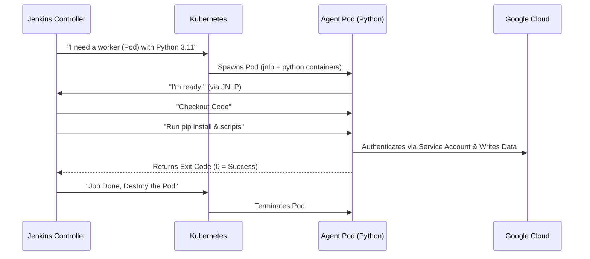

#  🛤️ Jenkins Pipelines (CI/CD)

This directory contains the **Declarative Jenkinsfiles** that drive the automation logic of the platform.
Instead of clicking through the Jenkins UI, we define our build processes as code, versioned alongside the application logic.

---

## 📂 Pipeline Catalog

### 1. `ci-pr-check.jenkinsfile` (The Guardian)
* **Type:** Multibranch Pipeline.
* **Trigger:** Automatically triggers on **Pull Requests** or commits to tracked branches.
* **Goal:** Verify code integrity before merging.

**🔍 Deep Dive:**
* **Conditional Execution:** Uses the `when { changeset "**/*.py" }` directive.
    * *Benefit:* If you only change `README.md`, the heavy Python tests are **skipped**, saving cluster resources and time.
* **Test Runner:** Executes `pytest` inside an isolated Python container.
* **Outcome:** Updates the GitHub PR status (Green Check / Red Cross).

### 2. `demo-pipeline.jenkinsfile` (The ETL Worker)
* **Type:** Standard Pipeline.
* **Trigger:** Manual (or Scheduled).
* **Goal:** Execute the core Data Engineering workload (`demo_pipeline.py`).

**🔍 Deep Dive:**
* **Context Injection:** Automatically injects the global `PROJECT_ID` into the container environment.
* **Secrets Management:** Leverages the bound Kubernetes Service Account (`jenkins-sa`) to authenticate with BigQuery without handling JSON keys.
* **Workload:**
    1.  Checkout Code.
    2.  Install `requirements.txt`.
    3.  Run the ETL script.

### 3. `create-table.jenkinsfile` (The Utility Tool)
* **Type:** Parameterized Pipeline.
* **Trigger:** Manual (User Input Required).
* **Goal:** Idempotent creation/update of BigQuery tables using JSON schemas.

**📋 Parameters:**
| Name | Default | Description |
| :--- | :--- | :--- |
| `DATASET_ID` | `jenkins_demo_db` | The target BigQuery Dataset. |
| `TABLE_ID` | `users_table` | The name of the table to create. |

**🔍 Deep Dive:**
* **Parameter Bridge:** Uses the `withEnv` block to map Jenkins User Inputs (`params.DATASET_ID`) to Python Environment Variables (`os.environ['DATASET_ID']`).
* **Schema Enforcement:** The pipeline assumes a strict naming convention for config files: `config/<DATASET>_<TABLE>.json`.

---

## 🏗️ Architecture: Ephemeral Kubernetes Agents

We do not use static build servers. Every single job spawns a **dedicated, disposable Kubernetes Pod**. This ensures a clean environment for every build and eliminates dependency conflicts.

### The "Pod Template" Pattern
Instead of relying on global configurations, we define the Agent infrastructure **inline** within the Jenkinsfile. This gives developers full control over their build environment.

**Example from `ci-pr-check.jenkinsfile`:**
```groovy
agent {
    kubernetes {
        yaml """
apiVersion: v1
kind: Pod
metadata:
  labels:
    app: python-tester
spec:
  serviceAccountName: jenkins-sa  # <--- Identity Binding
  containers:
  - name: python                  # <--- The Worker Container
    image: python:3.11-slim       # <--- The Exact Tool Version
    command: ['cat']
    tty: true                     # <--- Keeps container alive
    resources:
      requests:
        memory: "256Mi"
        cpu: "250m"
      limits:
        memory: "1Gi"             # <--- OOM Protection
        cpu: "1000m"
"""
    }
}

```

### Key Concepts in the Template:

1. **`serviceAccountName: jenkins-sa`**: This line grants the temporary Pod the "Badge" to talk to Google Cloud APIs (Workload Identity).
2. **`command: ['cat']` + `tty: true**`: This is a hack to keep the container running indefinitely (idle) so Jenkins can send shell commands to it. Without this, the container would start and exit immediately.
3. **`resources`**: We strictly define memory limits. If a Python script tries to eat 2GB of RAM, Kubernetes will kill it (`OOMKilled`) to protect the rest of the cluster.

---

## 🔄 How it Works (The Flow)



## 🛠 Usage Guide for Developers

1. **Modify Logic:** Edit the Python scripts in `app/`.
2. **Modify Infra:** Edit the `yaml` block inside the `Jenkinsfile` (e.g., to upgrade Python version or increase RAM).
3. **Push:**
* For `ci-pr-check`: Just push to a branch and open a PR.
* For others: Push to `main`, then trigger manually in Jenkins UI.


```
