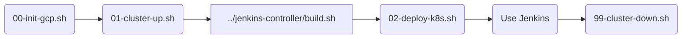

# 📜 Automation Scripts (DevOps Glue)

This directory contains the Bash scripts that automate the entire infrastructure lifecycle on Google Cloud Platform (GCP).
They act as the "glue" between your local development environment, the Google Cloud CLI (`gcloud`), and the Kubernetes cluster (`kubectl`).

---

## ⚠️ Prerequisites & Configuration

Before running any script, ensure the **Configuration Contract** is met:

1.  **`config.env`**: A file named `config.env` must exist in the **project root** (one level up). [cite_start]It must contain `PROJECT_ID`, `CLUSTER_NAME`, `ZONE`, and `IMAGE_URL`[cite: 1].
2.  **Tools**: `gcloud`, `kubectl`, and `envsubst` (usually part of `gettext`) must be installed.
3.  **Permissions**: You must be authenticated via `gcloud auth login` and have Editor/Owner permissions on the GCP Project.

---

## 🏃 Execution Order (The Lifecycle)

The scripts are numbered to represent the logical order of operations:



---

## 📂 Script Breakdown

### `00-init-gcp.sh` (Bootstrap)

**Goal:** Prepare the GCP Project environment one-time.

* 
**API Enablement:** Activates necessary Google APIs: `container` (GKE), `artifactregistry` (Docker Storage), `iamcredentials`, and `bigquery`.


* **Artifact Registry:** Creates a Docker repository.
* 
*Idempotency:* It checks if the repo exists (`gcloud artifacts repositories describe`) before trying to create it, preventing errors on re-runs.


* 
**Auth Config:** Configures the local Docker daemon to authenticate with Google's registry (`gcloud auth configure-docker`), allowing you to push images later.


### `01-cluster-up.sh` (Provisioning)

**Goal:** Spin up the compute infrastructure.

* **Spot Instances:** Creates a GKE Standard cluster using Spot VMs (`--spot`) to reduce cloud costs by up to 90%.
* **Workload Identity:** Enables the security bridge between K8s Service Accounts and GCP IAM Service Accounts. This is critical for the `jenkins-sa` to access BigQuery without JSON keys.
* **Node Count:** Provisions a single node (scalable via Autoscaler) sufficient for the Jenkins Controller and a few agents.

### `02-deploy-k8s.sh` (Deployment)

**Goal:** Deploy the Kubernetes manifests with dynamic variable injection.

* 
**Context Switch:** Fetches the `kubectl` credentials for the newly created cluster (`gcloud container clusters get-credentials`).


* 
**Namespace:** Creates the `jenkins` namespace if it doesn't exist.


* **Templating (`envsubst`):** This is the core logic. It loops through all `.yaml` files in `../k8s/`. It reads the files, replaces variables like `${PROJECT_ID}` and `${IMAGE_URL}` with real values from `config.env`, and pipes the result directly to `kubectl apply`.


```bash
envsubst < $file | kubectl apply -f -

```


* 
**Verification:** Waits for the deployment rollout to complete successfully before finishing.


### `99-cluster-down.sh` (Cleanup)

**Goal:** Destroy expensive resources to stop billing.

* **Destruction:** Deletes the entire GKE cluster.
* **Persistence:** It does **NOT** delete:
* The Artifact Registry (your built images remain safe).
* The BigQuery Data (your logs and tables remain safe).
* The PVC (Persistent Volume) *unless* the ReclaimPolicy is set to Delete (standard GKE behavior deletes the disk when the cluster dies).


---

## 🧠 Technical Highlights

### Robust Navigation

Every script starts with:

```bash
cd "$(dirname "$0")/.."
source ./config.env

```

. This ensures that no matter where you call the script from (e.g., `cd scripts && ./00...` or `./scripts/00...`), the script always correctly locates the project root and loads the configuration.

### Templating Strategy

Instead of using complex tools like Helm for this simple setup, we use `envsubst`. This keeps the manifest files (`k8s/*.yaml`) readable as standard YAML, while allowing environment-specific values to be injected at runtime.
